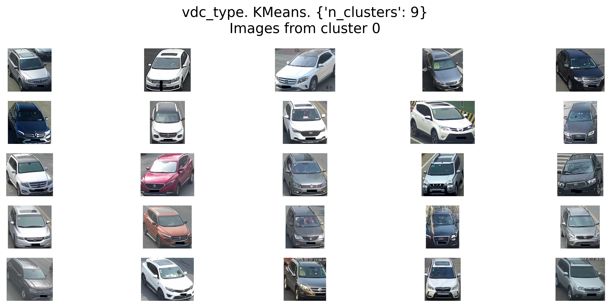
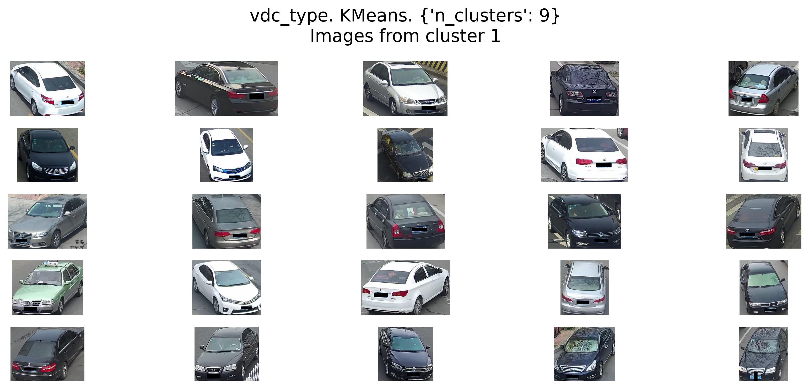
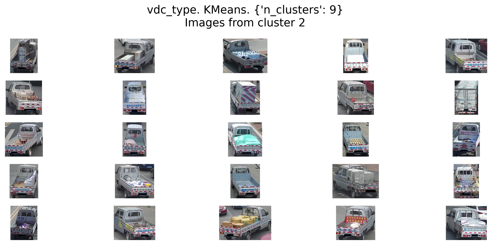
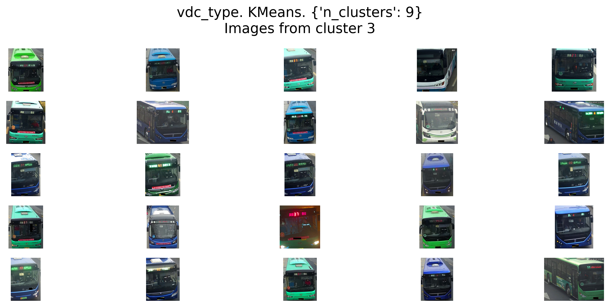
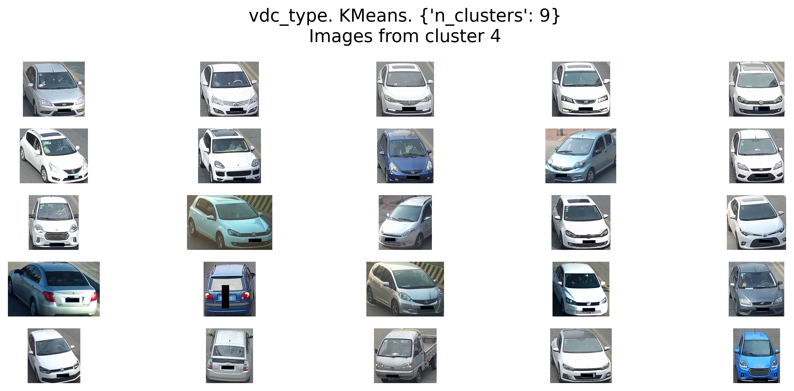
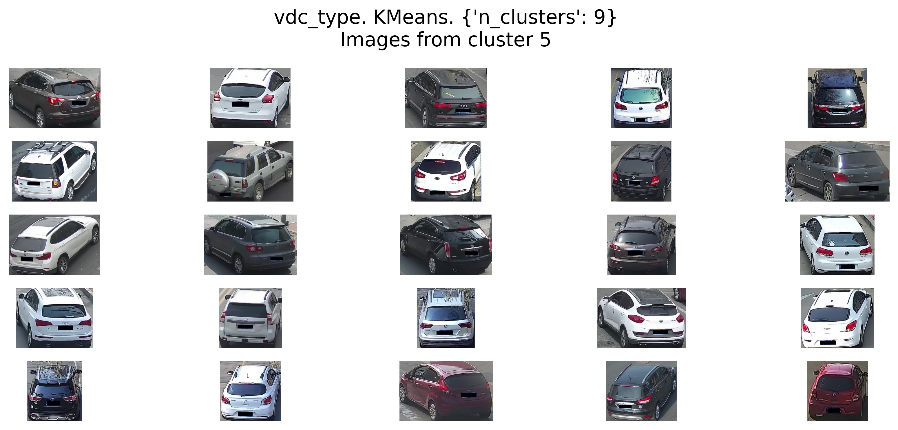
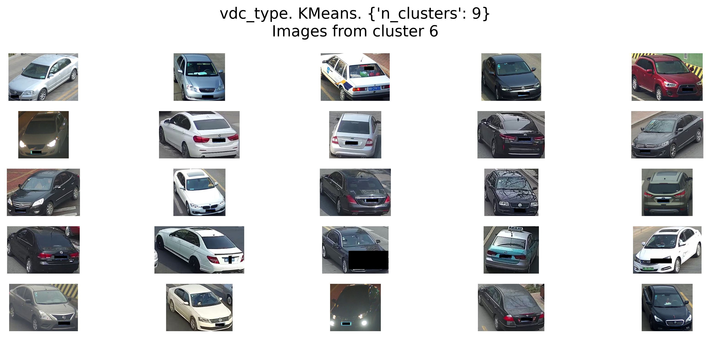
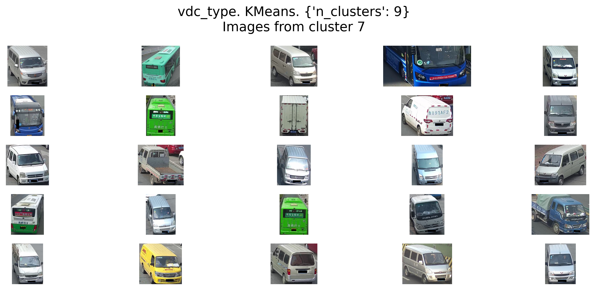
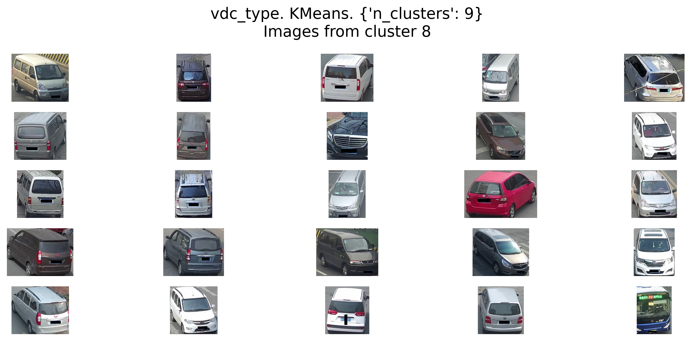

# Project 6. Image Clusterization

## README Content

[1. Project description](https://github.com/mvulf/sf_data_science/blob/main/project_6/README.md#Project-description)

[2. Case details](https://github.com/mvulf/sf_data_science/blob/main/project_6/README.md#Case-details)

[3. Data specification](https://github.com/mvulf/sf_data_science/blob/main/project_6/README.md#Data-specification)

[4. Project stages](https://github.com/mvulf/sf_data_science/blob/main/project_6/README.md#Project-stages)

[5. Results](https://github.com/mvulf/sf_data_science/blob/main/project_6/README.md#Results)

[6. Conclusion](https://github.com/mvulf/sf_data_science/blob/main/project_6/README.md#Conclusion)


### Project description

:arrow_up:[to content](https://github.com/mvulf/sf_data_science/blob/main/project_6/README.md#Content)

Один из ключевых проектов IntelliVision — Smart City/Transportation, система, обеспечивающая безопасность дорожного движения и более эффективную работу парковок. С помощью Smart City/Transportation можно контролировать сигналы светофоров и соблюдение ограничений скорости, определять виды транспортных средств, распознавать номерные знаки, считать автомобили и людей.

Для модификации и повышения эффективности системы Smart City/Transportation команде необходимо автоматизировать определение дополнительных параметров авто на изображении:

* тип автомобиля (кузова),
* ракурс снимка (вид сзади/спереди),
* цвет автомобиля,
* другие характеристики.

#### Project content

- [Main notebook](https://github.com/mvulf/sf_data_science/blob/main/project_6/PROJECT-6_Image_Clusterization.ipynb)

- [Full notebook](https://drive.google.com/file/d/1-KLwHn3zzptxH2Sg_NPnaS-qkmiq3Zaz/view?usp=sharing)

- data - папка с исходными данными

- results - папка с результатами исследования:
    - clusterization_scores.csv - результаты кластеризации на первой итерации
    - refined_scores.csv - результаты кластеризации на второй итерации
    - prefinal_scores.csv - результаты кластеризации на третьей итерации
    - **best_clusterization.csv** - датасет с путями до изображений и метками, проставленными лучшей моделью кластеризации (см. Results ниже)
    - *_n_clusters_scorе.png - графики зависимости метрик Калински-Харабаса и Дэвиса-Болдина от числа кластеров, построенных для различных дескрипторов
    - *_countplot.png - столбчатые диаграммы распределения изображений по кластерам, построенные для каждого дескриптора и модели
    - \*\_umap_*.png - изображения кластеров, построенных в 2D и 3D признаковом пространстве.
    - vdc_color_cluster_[#].png - примеры фотограффий, относящихся к кластеру [#], выделенных на дескрипторе цвета авто 
    - **vdc_type_cluster_[#].png** - примеры фотограффий, относящихся к кластеру [#], выделенных на дескрипторе типа авто

- utils.py - модуль с написанными классами для работы с данными (с целью экономии памяти GPU): DataLoader, DataKeeper; также функции для поиска параметров (conduct_grid_search); отображения моделей, сортированных по метрикам (display_models); построения столбчатых диаграмм (countplot_clusters) и функции визуализации кластеров (get_cluster_visualization)

### Case details

Необходима комплексная модель, которая могла бы одновременно находить на изображении автомобиль и определять все нужные параметры. Её нужно построить, однако многокомпонентная разметка новых данных по всем этим параметрам — очень трудозатратное занятие, которое стоит больших денег.

При решении задачи разметки данных у команды возникла гипотеза, которая нуждается в исследовании.

**Гипотеза:** разметку исходных данных можно эффективно провести с помощью методов кластеризации. 

**Бизнес-задача**: исследовать возможность применения алгоритмов кластеризации для разметки новых данных и поиска выбросов.

**Техническая задача** для специалиста в Data Science: построить модель кластеризации изображений на основе дескрипторов, выделяемых с помощью различных архитектур нейронных сетей, проинтерпретировать полученные результаты и выбрать модель или комбинацию моделей, которая выделяет наиболее пригодные для интерпретации признаки.

**Conditions:**

*Давайте будем использовать небольшой набор моделей свёрточных нейронных сетей, обученных на различных датасетах и решающих различные задачи от классификации изображений по цвету до классификации типов транспортных средств, пропустим нашу базу изображений через каждую модель, но возьмём не выходной результат модели, а только промежуточное представление признаков (дескриптор), полученное на свёрточных слоях сети.*

*Выполним такую операцию для всех изображений из набора данных, на основе полученных дескрипторов кластеризуем изображения, проинтерпретируем полученные кластеры и попробуем найти в них необходимую информацию.*


**Quality metric**

При выборе алгоритма кластеризации следует ориентироваться на внутренние метрики, а именно на индекс Калински — Харабаса (`calinski_harabasz_score`) и индекс Дэвиса — Болдина (`davies_bouldin_score`), а также на интерпретируемость кластеров и визуализацию.

**Resources:**
- SOFT:
    - cupy, cuml - библиотеки для матричных вычислений и машинного обучения на графическом ядре (GPU)
    - sklearn.metrics - метрики, взятые для кластеризации (см. выше)
    - Matplotlib, Seaborn - визуализация

- GPU: NVIDIA GEFORCE GTX 1080Ti (11 GB)

:arrow_up:[to content](https://github.com/mvulf/sf_data_science/blob/main/project_6/README.md#Content)

### Data specification

Имеется набор из 416 314 изображений транспортных средств различных типов, цветов и снятых с разных ракурсов. Данные можно скачать [отсюда](https://drive.google.com/file/d/1vkQaj0Lr4Jwkumli7k9IzCtxFP1tIoXH/view).

Исходная папка с данными имеет следующую структуру:

```
IntelliVision_case
├─descriptors
    └─efficientnet-b7.pickle
    └─osnet.pickle
    └─vdc_color.pickle
    └─vdc_type.pickle
├─row_data
    └─veriwild.zip
├─images_paths.csv 
```

* В папке `descriptors` содержатся дескрипторы, полученные для каждого из изображений с помощью соответствующих нейронных сетей, в формате numpy-массивов, сохранённых в файлах pickle:
    * `efficientnet-b7.pickle` — дескрипторы, выделенные моделью классификации с архитектурой EfficientNet версии 7. Эта модель является свёрточной нейронной сетью, предобученной на на датасете ImageNet, в котором содержатся изображения более 1000 различных классов. Эта модель при обучении не видела датасета veriwiId. 

    * `osnet.pickle` — дескрипторы, выделенные моделью OSNet, обученной для детектирования людей, животных и машин. Модель не обучалась на исходном датасете veriwiId.

    * `vdc_color.pickle` — дескрипторы, выделенные моделью регрессии для определения цвета транспортных средств в формате RGB. Частично обучена на исходном датасете veriwild.
    
    * `vdc_type.pickle` — дескрипторы, выделенные моделью классификации транспортных средств по типу на десяти классах. Частично обучена на исходном датасете veriwild.

* В папке `row_data` содержится zip-архив с исходными изображениями автомобилей. Распакуйте его содержимое в папку row_data. Архив содержит десять папок с изображениями, пронумерованных от 1 до 10. Каждая папка содержит подпапки, обозначенные пятизначными цифрами, например 36191. 

В каждой из таких подпапок содержатся фотографии одного конкретного автомобиля с разных ракурсов, снятые с помощью дорожных видеокамер.

* В файле `images_paths.csv` представлен список из полных путей до изображений. Он пригодится вам при анализе изображений, попавших в определённый кластер.


:arrow_up:[to content](https://github.com/mvulf/sf_data_science/blob/main/project_6/README.md#Content)

### Project stages

1. Для каждого типа дескрипторов необходимо:
    * выполнить предобработку дескрипторов;
    * произвести кластеризацию изображений на основе их дескрипторов, подобрав алгоритм и параметры кластеризации;
    * сделать визуализацию полученных кластеров в 2D- или 3D-пространстве;
    * проинтерпретировать полученные кластеры — в паре предложений сформулировать, какие изображения попали в каждый из кластеров.
2. Сравнить между собой полученные кластеризации для каждого типа дескрипторов (по метрикам, визуализации и результатам интерпретации).
3. Выполнить автоматизированный поиск выбросов среди изображений на основе дескрипторов.

:arrow_up:[to content](https://github.com/mvulf/sf_data_science/blob/main/project_6/README.md#Content)

### Results

Проводилась кластеризация 416314 изображений с камер по их четырём дескрипторам.

**Снижение размерности.** Для снижения размерности применялся метод главных компонент (PCA), причём количество признаков определялось "объясняемым" разбросом таким образом, чтобы значение было больше 60%. 

**Масштабирование**. Проведённый в разделе 3.1. сравнительный анализ качества методов масштабирования для всех дескрипторов и моделей типа KMeans, DBSCAN и HDBSCAN показал, что наивысшие значения индекса Калински-Харабаса и наименьшие значения индекса Дэвиса-Болдина достигаются при Нормализации (**MinMaxScaler**). Именно этот метод масштабирования и использовался в последствии.

Из 870 моделей были отобраны 34 модели кластеризации, которые сравнивались между собой по индексу Калински — Харабаса (`calinski_harabasz_score`) и индексу Дэвиса — Болдина (`davies_bouldin_score`), а также по интерпретируемости кластеров и визуализации.

При этом наилучшие показатели достигаются у дескрипторов "vdc_color" и "osnet"

При визуализации кластеров наихудшим образом себя продемонстрировал дескриптор "efficient-b7". 

Наилучшим образом показали себя дескрипторы "vdc_color" и "vdc_type", кластеризованные моделью KMeans с числом кластеров 7.

При обработке выбросов не удалось достигнуть качественного результата, при необходимости, возможно более глубокое исследование. На текущий момент наилучшая из имеющихся модель **"osnet. DBSCAN. {'eps': 1, 'min_samples': 1024}"**. В кластер выбросов попало больше кадров со свисающими ветвями, бликами от деревьев и изображений с надписями - как на самом кадре, так и на машинах.

**В итоге**, по интерпретации изображений, попавших в кластеры, были выделены две модели:
- vdc_type. KMeans. 9 кластеров - выделяет типы авто.
- vdc_color. KMeans. 7 кластеров - выделяет цвет авто (метки представлены в PROJECT-6_Image_Clusterization.ipynb).

Причём первая из них более информативна.

:arrow_up:[to content](https://github.com/mvulf/sf_data_science/blob/main/project_6/README.md#Content)

### Conclusion

:arrow_up:[to content](https://github.com/mvulf/sf_data_science/blob/main/project_6/README.md#Content)

Отобранная модель позволяет выделять тип авто и вид спереди/сзади:

0. кроссоверы (вид спереди)

1. седаны

2. грузовики

3. автобусы

4. седаны (вид спереди)

5. кроссоверы (вид сзади)

6. седаны

7. высокие авто - минивэны, грузовики автобусы

8. минивэны
